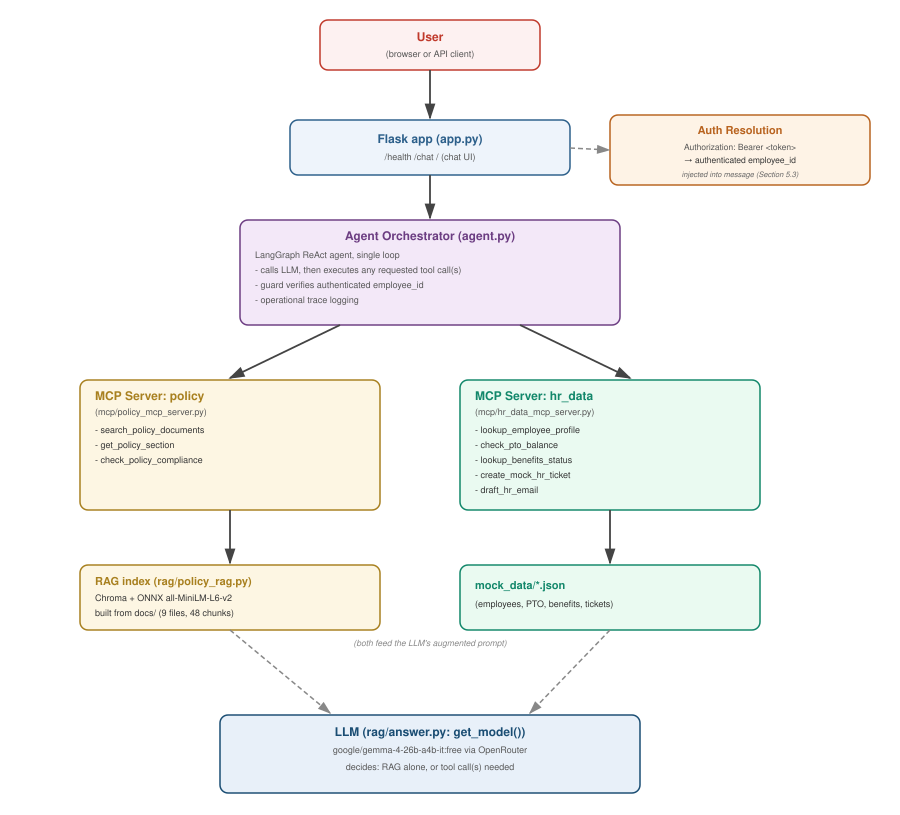
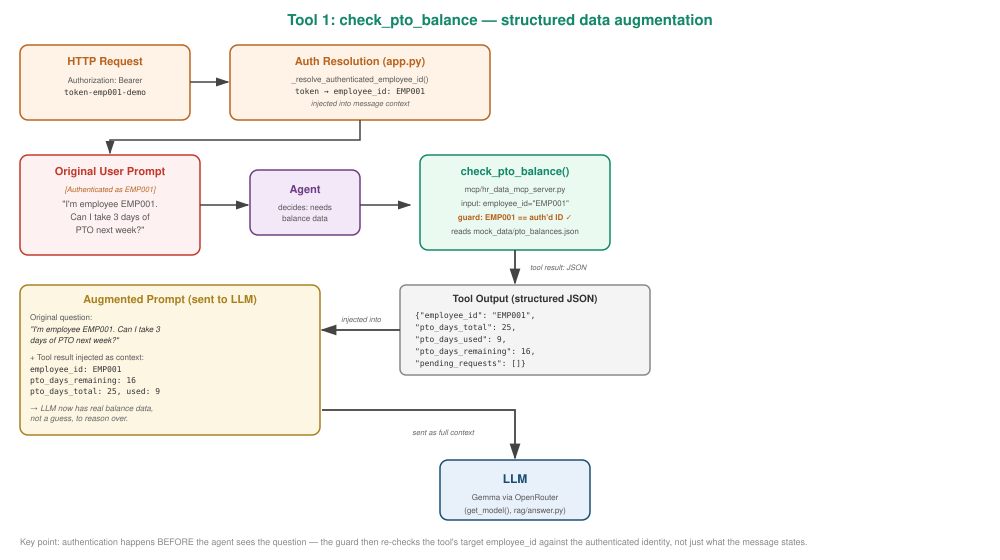
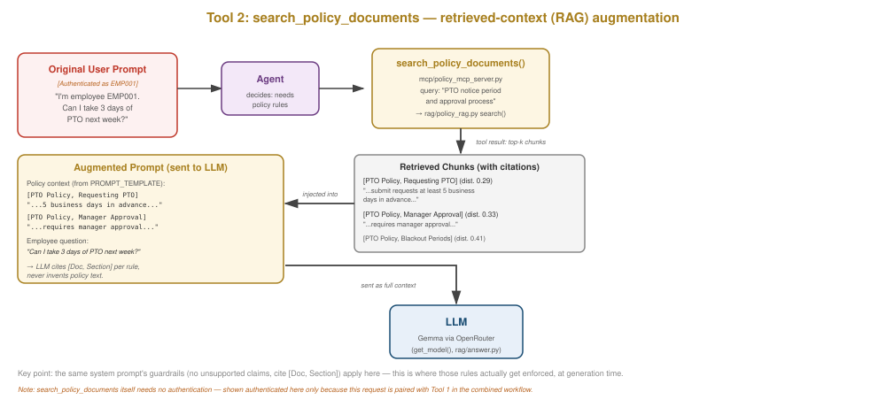
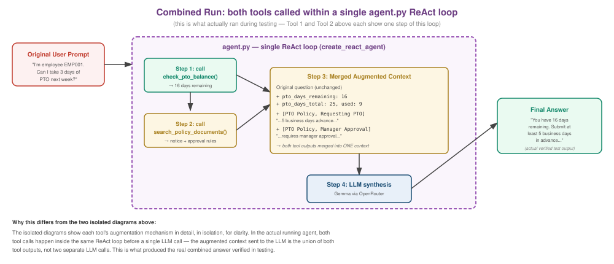

# Design and Evaluation

## 1. Architecture Overview

The system is a single-service agentic RAG application: one Flask web app, one LangGraph agent
orchestrator, two MCP servers, a local Chroma vector index, and mock structured HR data — all
running in one deployed process on Render's free tier, per the project brief's recommended
free-tier architecture.

*(An editable draw.io/diagrams.net source file for this diagram is included in the repository as
`architecture.drawio` — open it at [app.diagrams.net](https://app.diagrams.net) via File → Open
From → Device.)*

Both MCP servers run as local subprocesses over stdio, launched by `MultiServerMCPClient` when
the agent is built. The RAG index is rebuilt from the committed `docs/` corpus on every deploy
(via the build command), rather than persisted across deploys — appropriate since the corpus is
small and static, and Render's free tier disk is ephemeral.

---

## 2. RAG Design

**Corpus:** 9 policy documents (8 markdown, 1 HTML) covering PTO, remote work, data security,
expenses, benefits, onboarding, equipment, workplace conduct, and holidays.

**Chunking strategy:** heading-aware — splits on `##` (markdown) / `<h2>` (HTML) section headers,
implemented identically for both formats in `rag/policy_rag.py`. Chosen over fixed-size token
windows because the corpus documents were deliberately authored with one policy sub-topic per
section; heading boundaries already align with semantic boundaries, so this preserves chunk
coherence better than an arbitrary token cutoff would for this specific corpus. Produces 48 chunks
across the 9 documents.

**Embedding model:** Chroma's built-in `ONNXMiniLM_L6_V2` (same `all-MiniLM-L6-v2` model, via
`onnxruntime`). This was a deliberate switch from the original `SentenceTransformerEmbeddingFunction`
(sentence-transformers + PyTorch) after that approach caused the deployed app to exceed Render free
tier's 512 MB memory limit — see Section 6 (Deployment) for the full story. The same embedding
approach was also used in a separate prior project, suggesting this tradeoff isn't unique to this
codebase.

**Vector store:** Chroma, `PersistentClient`, local file storage at `chroma_db/` (gitignored,
rebuilt on every deploy from the committed corpus).

**Retrieval:** top-k similarity search (`n_results=top_k`, default 4), cosine distance computed
natively by Chroma/hnswlib — not implemented in this codebase.

**Prompting strategy:** retrieved chunks are injected into the LLM context with citation metadata
(`[Document Title, Section]` format), via a `ChatPromptTemplate` in `rag/answer.py` for the
single-shot RAG path, and via LangGraph's accumulated message history for the agentic path (see
Section 3).

**Guardrails (RAG-level, prompt-enforced):**
- Refuse/redirect out-of-corpus questions — verified (stock option vesting question correctly
  triggered 3 refined search attempts, then an honest "not found, contact HR" answer)
- Limit unsupported claims — answers instructed to stay traceable to retrieved context
- Distinguish policy facts from recommendations — answers explicitly label suggested next steps
  as "Recommendation:"

**Multi-document retrieval:** verified with a deliberately cross-referenced question (working
remotely from a Tier 3 country) that requires combining `remote_work_policy.md` (Cross-Border
Request process) with `data_security_policy.md` (Tier 1/2/3 data residency rules) — both were
correctly retrieved and cited together.

---

## 3. Agentic System Design

**Framework:** LangGraph's `create_agent` (aliased `create_react_agent` for continuity with an
earlier import path), a single ReAct loop: LLM call → check for `tool_calls` → execute tools →
loop back → repeat until the model returns a plain-text answer with no further tool calls.

**Orchestration decision-making:** the LLM itself decides, per question, whether to answer from
policy search alone or also call employee-specific tools — this is not hardcoded routing logic;
the decision is made by matching the question against each tool's name/description (auto-derived
from each `@mcp.tool()` function's docstring via MCP schema discovery).

**Two required workflows, both verified end-to-end:**
1. **PTO Request Guidance** — "Can I take 3 days of PTO next week? I'm employee EMP001." Agent
   calls `check_pto_balance` (confirms 16 days remaining) and `search_policy_documents` (retrieves
   notice period, approval, blackout period rules), synthesizes both into one grounded answer.
2. **Remote Work Eligibility** — "I'm employee EMP003, based in Remote-EU. Can I work from a
   country outside the EU for 6 weeks?" Agent calls `lookup_employee_profile` (confirms role/
   location/employment type) and `check_policy_compliance` (retrieves Tier 1/2/3 rules and the
   3-party approval chain), correctly flagging EMP003's contractor status as relevant.

**Operational trace logging:** `build_trace()` walks the full LangGraph message history and
extracts, per step: selected tool, exact arguments, exact (unwrapped) output, and whether the step
represents an escalation. `print_trace()` renders this with explicit `[LOOP START]`/`[LOOP END]`
markers, including the detected termination reason (natural completion vs. unexpected) — this
makes the loop's full lifecycle visible, not just the tool calls in between, and avoids exposing
hidden chain-of-thought.

**Loop control:** `RECURSION_LIMIT = 10`, passed explicitly via `config={"recursion_limit": ...}`
on every invocation — a project-authored ceiling rather than relying on the framework's
undocumented default.

**Resilience:** `invoke_with_retry()` retries up to 3 times (3s delay) on `ValueError`, since
OpenRouter's free-tier models occasionally return a 504/429 packaged inside a 200 OK response body
(an application-level error the underlying SDK's built-in retry logic doesn't catch).

**Graceful failure handling:** unknown employee IDs return a clean tool-level error
(`"No employee found with id ..."`) rather than crashing, confirmed via direct testing. Ambiguous
questions (Q16-Q20 in the eval set) mostly did not trigger tool calls, suggesting the agent leaned
toward answering directly rather than guessing at tool arguments — the specific content of those
five answers was not individually reviewed for clarification-seeking quality, so this remains an
observation from tool-call patterns rather than a fully verified behavior.

---

## 4. MCP Server and Tool Integration

**Transport:** stdio, two separate server processes launched by `MultiServerMCPClient`.

**`mcp/policy_mcp_server.py`** — RAG-backed tools:

| Tool | Purpose |
|---|---|
| `search_policy_documents(query, top_k=4)` | Top-k retrieval over the policy corpus |
| `get_policy_section(doc_id, section)` | Fetch a specific section's full text |
| `check_policy_compliance(topic, employee_context)` | Retrieval scoped to a topic + employee context, for compliance-style questions |

**`mcp/hr_data_mcp_server.py`** — mock structured data tools:

| Tool | Purpose |
|---|---|
| `lookup_employee_profile(employee_id)` | Role, location, manager, employment type |
| `check_pto_balance(employee_id)` | Total/used/remaining PTO days |
| `lookup_benefits_status(employee_id)` | Benefits elections and eligibility |
| `create_mock_hr_ticket(employee_id, subject, details, confirmed=False)` | Mock ticket creation, gated behind explicit confirmation |
| `draft_hr_email(to_employee_id, subject, body)` | Mock-only draft, never actually sent |

7 tools total (exceeds the 5-tool minimum); at least one uses the RAG index, at least one uses
mock structured data, satisfying both required categories.

**Verified runtime tool-calling:** confirmed via CI (`tests/test_smoke.py` — live MCP tool
discovery and a direct tool call, no LLM required) and extensively via manual/eval testing that
the agent genuinely calls tools through the MCP layer at runtime, not via hard-coded direct calls.

---

## 5. Safety Guardrails — Soft vs. Hard, and a Worked Example

A key design distinction, discovered through eval-driven debugging: **prompt-level (soft)
guardrails are requests the model can ignore; code-level (hard) guardrails are enforced regardless
of model behavior.**

### Hard guardrail: irreversible action confirmation
`create_mock_hr_ticket` cannot create a ticket unless `confirmed=True` is explicitly passed — this
check lives in the tool's own code, not a prompt. Verified working end-to-end via both terminal
and live HTTP testing: the agent correctly stops and relays the confirmation request rather than
auto-confirming.

### Case study: the hallucinated employee_id finding

**The problem (found via evaluation, not manual testing):** the 25-question eval set included
"How many floating holidays do I get?" — a question answerable from policy alone, with no employee
ID given. The agent nonetheless called `lookup_employee_profile` with a fabricated ID (`EMP12345`,
which doesn't exist in mock data), rather than answering from policy or asking for clarification.
Reproducible across both eval runs.

**Attempt 1 — prompt-level fix (soft):** added an explicit system-prompt instruction never to
invent an employee ID. Tested 3 times: **1/3 success**. The prompt reduced but did not reliably
eliminate the behavior — a real, measured limitation of instruction-only guardrails.

**Attempt 2 — code-level fix (hard):** wrapped every employee-specific tool
(`GUARDED_EMPLOYEE_TOOLS`) so that, before the real tool executes, a check confirms the
`employee_id` argument the model chose actually appears in the user's own message for that
request (tracked via a `contextvars.ContextVar` set fresh per request). If not, the call is
blocked and a structured rejection is returned instead — the fabricated ID never reaches the mock
data at all. Tested **6/6 clean** across local and live deployment testing — a substantial,
verified improvement over the soft version.

**Secondary finding and refinement:** testing the hard guardrail surfaced a separate, milder issue
— on 1 of the 6 trials, the agent skipped answering the generally-answerable part of the question
entirely and just asked for the employee ID upfront (still safe — no fabrication — but
unnecessarily unhelpful). The system prompt was refined to explicitly require answering the
general-policy part first, before ever asking for an ID. Tested **4/4 clean** afterward (2 local,
2 live).

This progression — soft fix, measured limits, hard fix, verified, secondary issue found, refined,
re-verified — is offered here as a complete, honest account rather than a claim of a single-pass
perfect solution.

---

## 6. Deployment

**Platform:** Render, free tier, single service.
**Live URL:** https://hr-agentic-rag-lmj7.onrender.com
**Build command:** `pip install -r requirements.txt && python rag/policy_rag.py --build`
**Start command:** `gunicorn app:app --bind 0.0.0.0:$PORT --workers 1 --timeout 120`

**A critical fix along the way:** the first deploy attempt failed with
`Ran out of memory (used over 512MB)`. Root cause: `SentenceTransformerEmbeddingFunction` pulls in
PyTorch (commonly 500MB-1GB+ once loaded), combined with gunicorn's main process plus two MCP
server subprocesses each with their own Python interpreter. Fixed by switching to Chroma's
lightweight ONNX embedding function (Section 2) and removing `sentence-transformers`/`torch`/
`transformers` from `requirements.txt` entirely. The second deploy attempt succeeded cleanly.

**Also required:** moving agent initialization from inside `if __name__ == "__main__":` to
module-import time in `app.py` — gunicorn imports the module directly and never executes that
block, so agent construction has to happen at import time to work under both `python app.py`
(local dev) and `gunicorn app:app` (production).

**Cold-start behavior:** Render's free tier spins down after inactivity; first request after
idle can take 50+ seconds. Documented in `deployed.md`.

Full details: `deployed.md`.

---

## 7. Evaluation Results

Full methodology, question set, and raw results: `evaluation/eval_questions.py`,
`evaluation/run_eval.py`, `evaluation/results.json`. Summary below.

**Evaluation set:** 25 questions, 5 per required category (straightforward, multi-document,
tool-requiring, ambiguous, out-of-scope), each with gold-answer notes and expected tool calls.

**A note on infrastructure noise:** the first full eval run produced misleadingly poor numbers
(16/25 tool match, 10/25 errors) due to OpenRouter free-tier rate limiting under rapid sequential
load (25 requests back-to-back exhausted both a per-minute and a per-day quota). After adding an
account credit top-up (raising the daily cap from 50 to 1000 requests) and an 8-second delay
between eval questions, a clean rerun produced the numbers below.

**Agent behavior metrics (clean run):**

| Metric | Result |
|---|---|
| Tool selection match | 21/25 (84%) |
| Errors | 1/25 (4%) — a timeout on a 3-attempt out-of-corpus retrieval, not a real failure (see below) |
| Rate-limit errors | 0/25 |

**System metrics:**

| Metric | Result |
|---|---|
| Latency p50 | 32.7s |
| Latency p95 | 62.6s |
| Cold-start delay | 50s+ (documented separately in deployed.md) |

**Answer quality:** verified systematically, not spot-checked, via `evaluation/verify_results.py`.
**Citation validity: 25/25 (100%)** — every citation's `(doc_title, section)` pair was checked
programmatically against the actual corpus in `docs/`, confirming none were fabricated or
mismatched. **Groundedness:** an automated heuristic (checks whether numeric claims in each answer
appear in that question's retrieved text) initially flagged 5/25 results. Manual review of the
flagged answers found all 5 to be false positives from the heuristic itself — markdown list
numbering ("1.", "2.", "3.") misread as factual claims, one correctly-derived fact (an empty
`pending_requests` list correctly reported as "0 days"), and one explicitly-labeled illustrative
example ("e.g., increased sales by 10%") rather than a claim about the user. True groundedness
rate after review: **25/25 clean**.

**Ablation / comparison:** prompt-only vs. code-level guardrail for the hallucinated-employee-ID
fix — 1/3 vs. 6/6 success (Section 5). This is the project's primary ablation, directly comparing
two implementations of the same guardrail intent.

### Notable individual findings

**Q21 (out-of-scope — stock option vesting):** the one "error" in the clean run was a JSON parse
timeout during the eval run. Manually retested: the agent correctly made 3 progressively refined
`search_policy_documents` queries, found nothing relevant, and gave an honest refusal
("unable to find any specific details... recommend checking your employment agreement"), directing
the user to HR — the out-of-corpus guardrail working as intended. **Minor known limitation:** the
`/chat` citation-extraction logic surfaces every retrieved chunk, including ones the LLM explicitly
said weren't relevant, rather than only chunks actually used in the final answer.

**Q3 (ambiguous — floating holidays):** the hallucinated-employee-ID finding described in
Section 5 — found via this eval question, fixed, and reverified.

---

## 8. Demo Tasks and Tool-Call Walkthrough

### 8.1 The Two Required Demo Tasks

| Task | Expected MCP call sequence |
|---|---|
| **PTO Request Guidance** — "Can I take 3 days of PTO next week? I'm employee EMP001." | 1. `check_pto_balance(employee_id="EMP001")` → 16 days remaining. 2. `search_policy_documents(query="PTO notice period and approval process")` → notice/approval/blackout rules. 3. LLM synthesizes both into one cited answer. |
| **Remote Work Eligibility** — "I'm employee EMP003, based in Remote-EU. Can I work from a country outside the EU for 6 weeks?" | 1. `lookup_employee_profile(employee_id="EMP003")` → role, location, employment type. 2. `check_policy_compliance(topic="remote_work", employee_context={...})` → Tier 1/2/3 rules, approval chain. 3. LLM synthesizes into a grounded eligibility answer. |

Full step-by-step code walkthrough (exact lines, exact data flow) for both tasks: see
`tool-call-breakdown.md` in the repository.

### 8.2 Tool-Call Mechanics Walkthrough — PTO Request Guidance

The two tools below both belong to **one** of the two tasks above — PTO Request Guidance — shown
here to illustrate exactly how each tool call augments the LLM's prompt, and how those two
mechanisms combine within a single agent run. (Remote Work Eligibility follows the same underlying
mechanics — `lookup_employee_profile` is a structured-data call like Tool 1 below,
`check_policy_compliance` is a RAG call like Tool 2 below — so it isn't walked through separately
here to avoid repeating the same two patterns twice.)

Tool 1 and Tool 2 are deliberately kept as separate diagrams, since they represent genuinely
different augmentation mechanisms, not just two examples of the same thing. The combined walkthrough
that follows then shows both firing together within a single real agent run.

### Tool 1 — `check_pto_balance`: structured data augmentation

An exact-match lookup against `mock_data/pto_balances.json` (synthetic internal records) — no
embeddings or vector search involved. The returned JSON facts (e.g. `pto_days_remaining: 16`) are
serialized directly into the LLM's context as ground-truth data points.

### Tool 2 — `search_policy_documents`: retrieved-context (RAG) augmentation

The query is embedded and compared via vector similarity against the 48 stored chunks in
`chroma_db/`; the top-k matches (unstructured text, not structured facts) are injected as
grounding context, each tagged with citation metadata.

### Combined Walkthrough — Both Tools Within a Single ReAct Loop

Shows both patterns firing together within one real agent run (the PTO Request Guidance task),
demonstrating that the agent can and does compose structured-data lookups with RAG retrieval in a
single response rather than only ever using one mechanism at a time.
